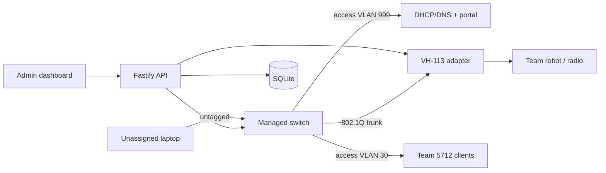

# FRC Practice Network

FRC Practice Network is a small, standalone networking service for practice fields and scrimmage environments. It gives a team a temporary, isolated wired/wireless network without requiring a match-running FMS. A laptop is placed on an onboarding VLAN, the operator enters an FRC team number, and the service moves the laptop's physical switch port to that team's VLAN.

The primary resource is a **team network**: a VLAN-backed network that can contain one or more wired client ports and (when configured) one access-point slot. Teams are not modeled as alliance stations. The six station names sometimes exposed by VH-113 firmware are adapter details only.

This repository is a TypeScript Bun monorepo using Turborepo, React/Vite, Fastify, Zod, SQLite, and Vitest. Hardware is accessed through interfaces, so the complete workflow can be developed with a mock managed switch, mock DHCP lease provider, and mock VH-113.

## Scope

The MVP covers:

- team-network and VLAN allocation with persistent state;
- managed-switch access/trunk VLAN configuration, link state, port enable/disable, bouncing, and MAC-table lookup;
- access-point configuration/status behind a separate adapter boundary;
- captive-portal correlation from HTTP IP → DHCP lease → MAC → switch port;
- an operator dashboard, a simple onboarding page, and reconciliation/drift reporting;
- deterministic demo data and simulation controls for events without hardware.

It deliberately does not implement match scheduling, scoring, alliances, field timers, audience displays, FMS protocols, Driver Station enable/disable, E-stop, routing, QoS, ACLs, LACP, STP, or PoE. A future scrimmage/Driver Station control module must remain separate from the networking domain; see [the architecture guide](docs/architecture.md).

## Run the simulated field

The intended development path is:

```sh
pnpm install
pnpm dev
```

Bun is also supported for workspace task orchestration:

```sh
bun install
bun run dev
```

The development profile uses SQLite locally and mock adapters. It should not need root networking privileges, a managed switch, or a VH-113. Use the development controls to toggle a simulated link, learn/forget a fake MAC, associate/disassociate a robot, or make a simulated device unavailable. Disabling a mock port forces its link down and flushes learned MACs; returning a port to onboarding clears its team assignment, puts it on the onboarding VLAN, enables it, and flushes learned MACs. The simulated device must then be learned again before the portal can correlate it; its independently managed DHCP lease may be kept or replaced. Never point the mock profile at production hardware.

The development API is rooted at `/api/dev`: use `/switches/:id/ports/:portId` for port/link/MAC simulation, `/access-points/:id/stations/:slotId` for robot association, `/dhcp/leases` to create/update a lease and `/dhcp/leases/:ip` to delete one, `/failures` to inject adapter failures, and `/reset` for recovery. `POST /api/dev/reset` accepts `{ "mode": "hardware-to-desired" }` (or `{ "scope": "hardware" }`) to restore persisted desired state while preserving teams and DHCP leases, or `{ "mode": "seeded-demo" }` (or `{ "scope": "demo" }`) to replace the complete simulator fixture. See [development.md](docs/development.md) for payloads and safety details.

The exact web and API ports are configured by the app packages/environment and should be shown by the dev command. The REST API is rooted at `/api`; the main resources are documented in [architecture.md](docs/architecture.md) and the onboarding flow in [captive-portal.md](docs/captive-portal.md).

## Repository map

```text
apps/web       React + Vite operator dashboard and captive portal
apps/server    Fastify API and application services
packages/core  Team-network domain model and service contracts
packages/switch  ManagedSwitch contract, mock adapter, vendor adapters
packages/ap    AccessPoint contract, mock and real VH-113 adapters
packages/db    SQLite schema and repositories
packages/ui    Shared React components
config/        Safe, non-secret demo configuration
docs/          Architecture, network, adapter, portal, and development guides
```

HTTP handlers should validate input and call application services. They must not contain switch commands or AP-specific behavior. Vendor command syntax belongs only in a vendor adapter package.

## Demo topology

The default example uses a 24-port switch, management VLAN 100, onboarding VLAN 999, and a configurable team VLAN pool (10–90 in the sample configuration). Demo seed data includes team networks such as 5712 and 862, multiple wired ports, an onboarding laptop, and a VH-113 with six simulated slots. These numbers are examples, not architectural limits.



Read the [hardware setup guide](docs/hardware-setup.md) before commissioning the
VH-113 or 5420M-48W-4YE, [network-design.md](docs/network-design.md) for the
logical topology, [hardware-adapters.md](docs/hardware-adapters.md) for adapter
behavior, and [development.md](docs/development.md) for tests and simulation
workflows.

## Security and operational notes

Management access and onboarding/client VLANs should be physically and logically separated according to the field's risk model. The application does not provide a router or firewall: DHCP, DNS, CAPPORT signaling, and any inter-VLAN policy are infrastructure responsibilities. Credentials are referenced through a credential-storage abstraction; local development may use SQLite only with clearly documented, restricted permissions. See [hardware-adapters.md](docs/hardware-adapters.md).

Hardware changes are observable operations. If a switch write, AP write, database transaction, or bounce fails, the service records an error and reconciliation reports desired-versus-actual drift instead of silently declaring success.

The development-only seeded-demo reset is available as `POST /api/dev/reset` with `{ "mode": "seeded-demo" }` (or the `{ "scope": "demo" }` alias). It is a destructive fixture operation that replaces the simulator/database state with the sample field and discards local demo changes. It is not the same as the safe `hardware-to-desired` recovery mode, which preserves teams and DHCP leases while repairing simulated hardware. Confirm the target and never expose a seeded-demo reset in a production profile.
