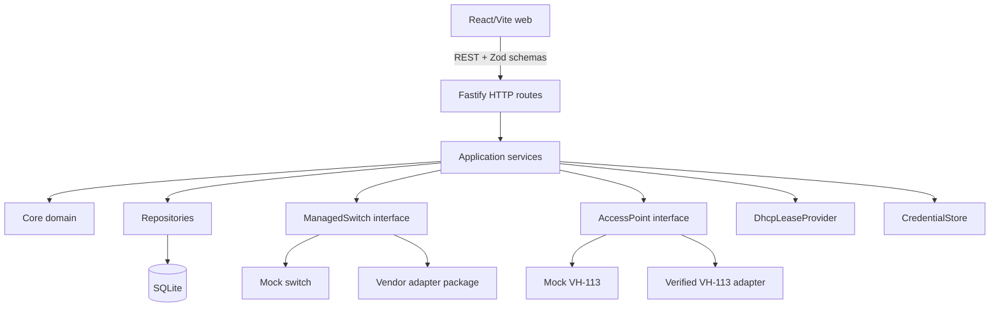
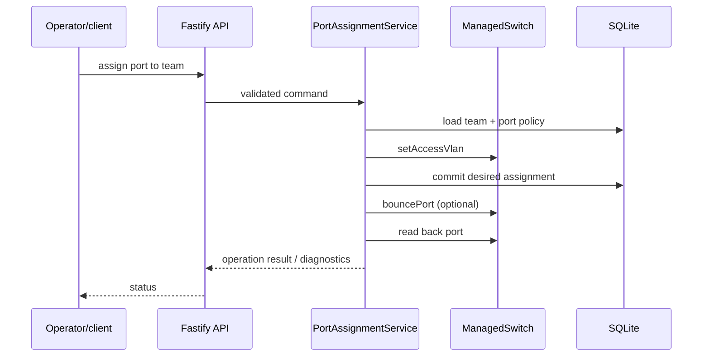

# Architecture

## Design goals

The system manages temporary isolated networks for FRC teams. It is not an FMS, and its domain model contains no alliance, station-color, match, scoring, or field-timer concepts. A `TeamNetwork` has an internal ID, an FRC team number, an allocated VLAN, optional AP binding, a status, and relationships to any number of wired ports.

The model must support multiple switches and access points, more than six teams, and multiple client ports per team. A VH-113 adapter may report `maxStations: 6` and slot IDs such as `red1`; those are capabilities and identifiers of that adapter, never core concepts.

## Boundaries



- **Core/domain**: value validation, team-network state, VLAN allocation rules, port assignment rules, and service contracts. It knows what a team network and a client port are, not how a switch CLI works.
- **Application services**: orchestrate repositories and hardware, own operation ordering, idempotency, error reporting, and reconciliation. Important services include `TeamNetworkService`, `PortAssignmentService`, `CaptivePortalService`, `VlanAllocator`, and `NetworkHealthService`.
- **Adapters**: implement `ManagedSwitch`, `AccessPoint`, `DhcpLeaseProvider`, and `CredentialStore`. Mock adapters are first-class implementations. Real adapters are isolated packages and may not leak vendor commands into routes or domain code.
- **HTTP**: parse and validate with shared Zod schemas, authorize administrative operations when deployed, translate domain errors into stable status codes, and return diagnostics. Routes do not orchestrate hardware directly.
- **Persistence**: SQLite stores desired configuration and operation metadata. Actual hardware state is read through adapters and is never assumed from the database alone.

## State and operations

A team network normally moves through `provisioning`, `waiting-for-robot`, `online`, `offline`, or `error`. Port assignments are separate records: a switch ID and port ID, optional team-network ID, role, and human label. This allows several ports to share one team VLAN.

Assigning a client port is an application operation:

1. Load and validate the target team network and switch port.
2. Reject reserved ports (management/AP trunk/server) and invalid roles.
3. Write the desired access VLAN to the switch.
4. Persist the assignment in a transaction, including an operation/error record if available.
5. Bounce the port using configured delay when requested.
6. Read back port state and report success only when the observed state is consistent.

The service is idempotent: assigning an already-correct port is safe, while changing team A to team B first removes the old desired relationship and then applies team B's VLAN. If hardware succeeds but persistence fails, the operation remains diagnosable as drift; it must not be silently reported as complete. If a later step fails, retain the last known error and offer reconciliation/repair.



## Reconciliation

SQLite is the desired-state record. `NetworkHealthService` periodically or on demand compares it with switch/AP observations:

- desired access VLAN versus actual access VLAN and mode;
- expected port role and assignment versus stored assignment;
- expected AP slot/team/VLAN versus AP-reported configuration;
- expected enabled/link state and discovered MACs where applicable.

It emits drift entries with resource, expected value, observed value, timestamp, and severity. A future repair command can use the same service methods, with explicit confirmation for disruptive changes. Reconciliation should be safe to run while a previous operation is in progress and should distinguish an unavailable adapter from a confirmed mismatch.

## Persistence and secrets

Persist team networks, VLAN allocations, switches, access points, port assignments, installation configuration, and operation/error metadata. Use foreign keys and transactions for allocation and assignment changes. Team network records may store an AP ID and slot ID, but not a physical station-color concept.

Wireless credentials are handled by `CredentialStore`, which returns an opaque reference to domain code. A local development implementation may store encrypted/protected values in SQLite or use environment variables; this is a convenience tradeoff, not a production security guarantee. Production deployments should use OS keychain, a secrets manager, or an encrypted store with rotation and audit controls.

## API shape

The REST API is intentionally resource-oriented. The initial surface may include:

```text
GET    /api/health
GET    /api/config
GET    /api/team-networks
POST   /api/team-networks
GET    /api/team-networks/:id
DELETE /api/team-networks/:id
POST   /api/team-networks/:id/ports
DELETE /api/team-networks/:id/ports/:portId
GET    /api/switches
GET    /api/switches/:id/ports
GET    /api/switches/:id/ports/:portId
POST   /api/switches/:id/ports/:portId/bounce
POST   /api/portal/session
POST   /api/portal/connect
GET    /api/access-points
GET    /api/reconciliation
```

Names can evolve, but request and response contracts should be shared Zod schemas. Errors should identify cases such as unknown team, reserved port, unknown requester MAC, stale DHCP lease, unavailable hardware, and VLAN write failure.

## Future Driver Station control

If scrimmage support later needs enable/disable or E-stop-like controls, add a separate `scrimmage` or `driver-station-control` bounded context and adapter. It may consume team-network IDs and health signals, but it must not add match, alliance, or station-slot fields to `TeamNetwork`, `PortAssignment`, or VLAN allocation. Network operations remain usable with that module disabled.
