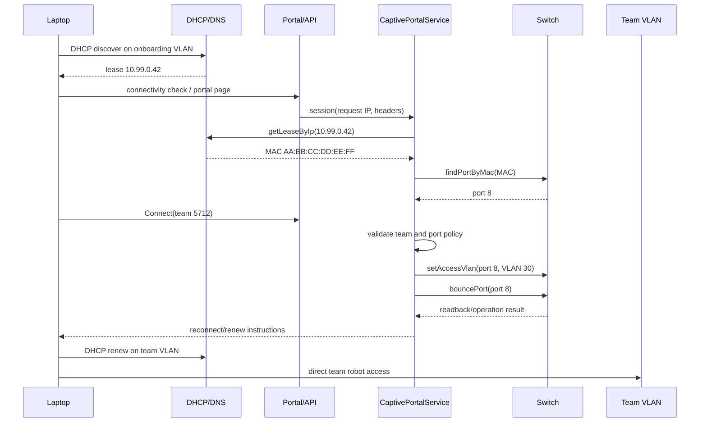

# Captive portal workflow

The onboarding page is intentionally small: “FRC Practice Network”, a team-number field, and a Connect action. Its job is to identify the requested team and hand the request to the server; it is not a DHCP server or a network router.

## Production flow

The critical correlation is HTTP client IP → DHCP lease → MAC → switch forwarding table → physical port. The service must normalize IP and MAC formats, reject stale/expired leases, and require a single unambiguous physical port. A client supplied MAC address is not trusted as a substitute for the lease lookup.

## Session and API behavior

`POST /api/portal/session` creates or refreshes a short-lived session from the requester's observed IP and returns safe diagnostics (for example, whether a port was found). `POST /api/portal/connect` accepts a positive FRC team number and a session/reference; the server re-resolves the lease/port immediately before changing hardware. Do not allow the browser to choose an arbitrary switch ID or reserved port.

Possible responses include:

- success: assigned VLAN, operation ID, and a message to renew DHCP;
- team not configured: ask an administrator to create/provision the team network;
- unknown or stale lease / unable to determine switch port: ask the user to reconnect or contact an operator;
- reserved port: explain that the port is infrastructure-only;
- switch/AP unavailable or VLAN write failure: retain an error and offer operator reconciliation.

If a team exists but its AP is not configured, the MVP can either reject the connection with “team has not been configured yet” or complete a wired assignment while marking the AP/team status `provisioning`/`waiting-for-robot`. The chosen policy must be explicit in the application configuration and UI.

## Captive-portal standards

Operating systems use vendor-specific connectivity checks. The deployment should provide expected DNS/HTTP behavior for those checks and eventually advertise a CAPPORT API/URI with DHCP option 114. CAPPORT support is an integration task, not a reason to couple the domain to one OS or run a custom DHCP implementation. See [network-design.md](network-design.md) for where DHCP and DNS live.

## Mock workflow

The development profile has a deterministic `DhcpLeaseProvider` and mock switch MAC table. Seed IP `10.99.0.42` can map to a fake MAC learned on port 8; connecting to a pre-created team then changes port 8's access VLAN and bounces it. Use `POST /api/dev/dhcp/leases` to create or replace a simulated lease and `DELETE /api/dev/dhcp/leases/:ip` to remove one. The switch-port simulator can clear/learn MACs and toggle link or adapter availability, so the UI and tests can exercise unknown-MAC and stale-lease paths without root privileges. After a port disable, onboarding return, bounce, or hardware-to-desired reset, re-learn the physical MAC and ensure the lease's IP-to-MAC mapping matches before reconnecting.

## Safety

Portal sessions should expire, be scoped to the observed requester, and be protected against CSRF/replay when deployed beyond a trusted practice LAN. Rate-limit team-number attempts and avoid exposing team lists or credentials unnecessarily. The service must not reassign management, AP trunk, server, or otherwise reserved ports based solely on a portal request.
