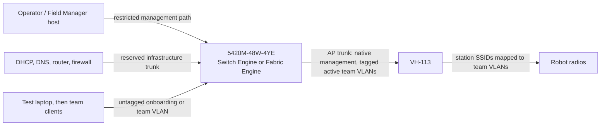

# Hardware setup guide

This guide commissions one Extreme Networks 5420M-48W-4YE managed switch and
one Vivid Hosting VH-113 field access point for FRC Practice Network. Complete
the work on an isolated bench before connecting team equipment.

> [!IMPORTANT]
> Production mode now uses the real switch/AP adapters and a read-only dnsmasq
> lease provider. Use the reviewed Raspberry Pi deployment profile; it does not
> register `/api/dev`. Commission on an isolated bench before field use.

## 1. Equipment and prerequisites

Have these items ready:

- an Extreme 5420M-48W-4YE booted into either **Switch Engine/ExtremeXOS** or
  **Fabric Engine/VOSS**;
- a VH-113 running firmware that exposes `frc-radio-api`;
- a Field Manager host with trusted access to both management endpoints;
- the Raspberry Pi deployment profile for onboarding DHCP/DNS and the Practice
  AP firmware for team-VLAN DHCP;
- a switch console cable and a local copy of the known-good switch
  configuration;
- an AP uplink cable and enough client/uplink cables for the planned topology;
- unique switch credentials and, if enabled on the AP, a bearer token;
- an approved channel, channel width, and regulatory configuration for the
  event location.

The application process does not implement DHCP. The supplied deployment runs
dnsmasq beside it for onboarding VLAN 999 only. Routing, firewalling, ACLs,
STP, LACP, and PoE control remain infrastructure responsibilities.

## 2. Freeze the field plan

Record the real values before entering any commands. The following is a
compatible example, not a universal default:

| Item                      | Example       | Notes                                            |
| ------------------------- | ------------- | ------------------------------------------------ |
| Management VLAN           | 100           | Native/untagged VLAN toward the VH-113           |
| Onboarding VLAN           | 999           | Initial untagged VLAN on client ports            |
| Active red bank           | 10, 20, 30    | Maps to red1, red2, red3                         |
| Active blue bank          | 40, 50, 60    | Maps to blue1, blue2, blue3                      |
| Spare bank                | 70, 80, 90    | May replace either alliance bank                 |
| Switch management address | Site-assigned | Dedicated Mgmt port or protected in-band address |
| AP management address     | Site-assigned | Reachable over the AP trunk's native VLAN        |
| Client ports              | Site-assigned | Only ports the application may reconfigure       |
| AP trunk port             | Site-assigned | Reserved; never a client port                    |
| Infrastructure uplink     | Site-assigned | Reserved and managed outside the application     |

The VH-113 does not accept an arbitrary VLAN for each slot. A slot's supported
VLANs are fixed by position:

| Slot  | Supported VLANs |
| ----- | --------------- |
| red1  | 10, 40, or 70   |
| red2  | 20, 50, or 80   |
| red3  | 30, 60, or 90   |
| blue1 | 10, 40, or 70   |
| blue2 | 20, 50, or 80   |
| blue3 | 30, 60, or 90   |

All three red slots use one bank, all three blue slots use one bank, and the
red and blue banks must be different. For six simultaneous networks, a simple
choice is red `10_20_30` and blue `40_50_60`. The allocator reads these
capabilities; it must not allocate VLAN 31 or another unsupported value to a
real VH-113 slot.

Use an SSID of 1-14 alphanumeric or hyphen characters and a WPA key of 8-16
alphanumeric characters. Field Manager's generated keys satisfy those limits.

## 3. Cable the bench topology

Keep management paths and team-facing ports distinct.



The switch's dedicated physical **Mgmt** port belongs to its special management
VLAN. That is separate from the configurable native VLAN carried to the AP.
It is valid to manage the switch out-of-band while managing the AP through
in-band VLAN 100. If the switch is managed in-band instead, reserve a protected
data port for that purpose and make sure the server cannot strand itself while
changing client ports.

Do not connect the client bank, production router, or VH-113 until switch
management works from the Field Manager host and a console recovery path is
available.

## 4. Commission the 5420M-48W-4YE

### 4.1 Establish console and management access

1. Connect locally to the serial console at 115200 baud, 8 data bits, no
   parity, and 1 stop bit.
2. Log in, set unique administrator and failsafe credentials, and store them in
   the approved secret manager. Never leave a factory or blank password in
   place.
3. Identify the active personality: use `show version` on Switch Engine, or
   `show sys-info` and `show software` on Fabric Engine/VOSS. Confirm the
   chassis is a 5420M-48W-4YE and later select the same personality with
   `FM_SWITCH_OS`.
4. Assign the approved management address. For a named in-band VLAN, Switch
   Engine uses the following form:

   ```text
   configure vlan <management-vlan-name> ipaddress <address> <mask>
   ```

   Fabric Engine can instead use its out-of-band management interface or a
   VLAN Management Instance. A minimal in-band example is:

   ```text
   enable
   configure terminal
   vlan create 100 name FM-Mgmt type port-mstprstp 0
   vlan create 999 name Onboarding type port-mstprstp 0
   vlan members add 100 1/47 portmember
   vlan members add 999 1/47 portmember
   vlan members remove 1 1/47 portmember
   interface GigabitEthernet 1/47
   encapsulation dot1q
   untagged-frames-discard
   no untag-port-default-vlan
   no shutdown
   exit
   mgmt vlan 100
   ip address 10.0.100.2/24
   enable
   end
   save config
   ```

   Replace the port, VLAN, and address with the frozen field plan. Keep the
   console attached because a management-VLAN change can end the remote path.

5. If the Field Manager host is outside that subnet, add only the reviewed
   management route/default gateway required by the site design.
6. Verify the new address from the Field Manager host before changing any data
   ports. Keep the console session open.

### 4.2A Enable the Switch Engine transport

The adapter sends Basic-authenticated JSON-RPC `cli` requests to `/jsonrpc/`.
Enable HTTPS on Switch Engine:

```text
enable web https
```

Install a certificate whose chain and hostname/IP are trusted by the Field
Manager host. The adapter deliberately has no "ignore TLS errors" switch. An
isolated HTTP bench test can use an explicit `http://` base URL, but production
management should use HTTPS and a restricted management network. Do not use
`enable switch access` merely to enable the API: it enables several additional
management services.

Check reachability without placing a password in source control:

```sh
curl --fail --show-error --user "$FM_SWITCH_USER:$FM_SWITCH_PASSWORD" \
  --header 'Content-Type: application/json' \
  --data '{"jsonrpc":"2.0","method":"cli","params":["show version"],"id":1}' \
  https://switch-management.example/jsonrpc/
```

A JSON-RPC response is required. A login page, HTML error, certificate error,
or Fabric Engine response is not sufficient.

### 4.2B Enable the Fabric Engine/VOSS transport

The Fabric Engine adapter uses the interactive SSH CLI. From the console,
enable SSH if it is not already enabled and save the change:

```text
enable
configure terminal
ssh key-exchange-method diffie-hellman-group-exchange-sha256
boot config flags sshd
end
save config
```

Confirm that `show ssh global` lists
`diffie-hellman-group-exchange-sha256`. Current OpenSSH and the Field Manager
adapter reject a switch that offers only the legacy
`diffie-hellman-group14-sha1` and `diffie-hellman-group1-sha1` methods unless
the adapter's explicit legacy compatibility option is enabled. If the
new method is listed but is not offered to a new connection, restart the SSH
service with `ssh reset` from Global Configuration mode while the console is
still attached. VOSS added the SHA-256 group-exchange option in 8.4.2. If the
CLI rejects that option, record `show software` and plan a reviewed VOSS
upgrade; use a per-connection legacy KEX override only for an isolated bench
test, never as a machine-wide SSH default. If an upgrade cannot happen before
deployment, set `FM_SWITCH_ALLOW_LEGACY_SSH_KEX=true`; the adapter then adds
only group14-sha1, not the weaker group1 method, while retaining mandatory host
key pinning. Return the setting to `false` after upgrading.

Use a dedicated account with only the privileges needed for the documented
show, VLAN, port, FDB-clear, and save commands. Verify login from the Pi:

```sh
ssh "$FM_SWITCH_USER@10.0.100.2" 'show sys-info'
```

Pin the host key. Obtain its fingerprint through the trusted console or a
previously verified management path, compare it with the value shown by SSH,
then put the exact OpenSSH `SHA256:...` value in
`FM_SWITCH_SSH_HOST_KEY_SHA256`. The adapter refuses a missing or changed key.
For example, this prints the fingerprints advertised at the reviewed address;
do not trust the scan until it has been independently compared:

```sh
ssh-keyscan -p 22 10.0.100.2 2>/dev/null | ssh-keygen -lf - -E sha256
```

### 4.3 Build the VLAN baseline

Before making changes, capture the OS-specific running configuration, VLAN and
port state, and current management route (`show configuration` on Switch Engine
or `show running-config` on Fabric Engine). Use the site's approved
backup/export procedure. Do not remove the default VLAN or current management
path until the replacement path has been tested.

Pre-create and name the management, onboarding, and active team VLANs. The
adapter can create a missing VLAN as `FM-<VID>`, but pre-provisioning gives the
operator a reviewable baseline. Typical Switch Engine command forms are:

```text
create vlan FM-Mgmt tag 100
create vlan Onboarding tag 999
create vlan Team-10 tag 10
create vlan Team-20 tag 20
create vlan Team-30 tag 30
create vlan Team-40 tag 40
create vlan Team-50 tag 50
create vlan Team-60 tag 60
```

The equivalent Fabric Engine/VOSS baseline is:

```text
enable
configure terminal
vlan create 100 name FM-Mgmt type port-mstprstp 0
vlan create 999 name Onboarding type port-mstprstp 0
vlan create 10 name Team-10 type port-mstprstp 0
vlan create 20 name Team-20 type port-mstprstp 0
vlan create 30 name Team-30 type port-mstprstp 0
vlan create 40 name Team-40 type port-mstprstp 0
vlan create 50 name Team-50 type port-mstprstp 0
vlan create 60 name Team-60 type port-mstprstp 0
end
save config
```

Adapt names and VLAN IDs to the frozen field plan. Never reuse VLAN 1 for
unassigned clients or management.

Configure only the reviewed ports:

- client ports: untagged onboarding VLAN 999 at rest;
- AP port: native/untagged management VLAN 100, with active team VLANs tagged;
- infrastructure uplink: VLAN 999 and every active team VLAN required by the
  DHCP/router design;
- Field Manager/management port: protected management access or the reviewed
  management trunk;
- unused ports: disabled or placed in an inert site-approved VLAN.

For the example Fabric Engine port plan, the essential port forms are:

VOSS Auto-sense can place an uncommissioned port in the private onboarding VLAN 4048. Disable Auto-sense on each application-owned port before changing its
VLAN configuration, then use `show vlan members port <slot/port>` to identify
and remove its current VLAN. The examples below show VLAN 4048 as the initial
membership; substitute VLAN 1 if that is what the readback reports.

```text
enable
configure terminal

# Client access port at rest
interface GigabitEthernet 1/1
no auto-sense enable
exit
vlan members remove 4048 1/1 portmember
vlan members add 999 1/1 portmember
interface GigabitEthernet 1/1
no untag-port-default-vlan
no encapsulation dot1q
default-vlan-id 999
no untagged-frames-discard
tagged-frames-discard enable
no shutdown
exit

# Pi trunk: management and onboarding are both tagged
interface GigabitEthernet 1/47
no auto-sense enable
exit
vlan members remove 4048 1/47 portmember
vlan members add 100 1/47 portmember
vlan members add 999 1/47 portmember
interface GigabitEthernet 1/47
encapsulation dot1q
untagged-frames-discard
no untag-port-default-vlan
no tagged-frames-discard
no shutdown
exit

# VH-113 trunk baseline: management is native; Field Manager adds team VLANs
interface GigabitEthernet 1/48
no auto-sense enable
exit
vlan members remove 4048 1/48 portmember
vlan members add 100 1/48 portmember
interface GigabitEthernet 1/48
encapsulation dot1q
default-vlan-id 100
no untagged-frames-discard
untag-port-default-vlan enable
no tagged-frames-discard
no shutdown
exit
end
save config
```

VOSS comments must be full lines; if the installed release rejects the `#`
labels above, enter only the command lines. Apply the client form only to the
explicitly approved client bank, not to infrastructure ports.

Do not add onboarding VLAN 999 to the VH-113 trunk. The baseline AP port has
only native/untagged VLAN 100; after a team network is allocated, Field Manager
adds that team's VLAN as tagged membership and removes it again when the team
network is deleted.

Do not copy a numeric port range from this guide. Confirm the standalone or
stacked port IDs on the installed switch. The Switch Engine adapter defaults to
`1` through `52`; the Fabric Engine adapter defaults to `1/1` through `1/52`.
Channelized or multi-unit systems can expose another form, which must be listed
explicitly in `FM_SWITCH_PORT_IDS`.

After every trunk change, confirm membership and native VLAN:

- Switch Engine: `show port <port> vid` and `show vlan`
- Fabric Engine: `show interfaces gigabitEthernet vlan` and
  `show vlan members port <slot/port>`

Save the stable baseline only after console, management, DHCP, and AP paths
have all passed readback.

## 5. Commission the VH-113

1. Connect the VH-113 to the reserved AP trunk only after validating that
   trunk's native management VLAN.
2. Give the AP its approved management address and confirm it is reachable from
   the Field Manager host.
3. Confirm that the installed firmware exposes `frc-radio-api`, normally on
   port 8081. If bearer authentication is enabled, load the token into the
   Field Manager secret environment without committing it:

   ```sh
   read -r -s VH113_TOKEN
   export VH113_TOKEN
   curl --fail --show-error \
     --header "Authorization: Bearer $VH113_TOKEN" \
     http://ap-management.example:8081/health
   curl --fail --show-error \
     --header "Authorization: Bearer $VH113_TOKEN" \
     http://ap-management.example:8081/status
   ```

4. Record the firmware version, channel, channel width, red/blue banks, and all
   six current station configurations.
5. Verify that the chosen red and blue banks match the team VLANs tagged on the
   switch's AP port.
6. Configure one unused station first, associate a test radio, and verify that
   its MAC appears in the switch FDB on the correct VLAN.

The AP configuration endpoint replaces the complete six-slot document and its
status response does not reveal plaintext WPA keys. Consequently,
`VH113AccessPoint` refuses to change one slot if it cannot safely preserve the
plaintext desired state of the other configured slots. On process startup,
load every active slot into `initialConfigurations` from the credential store.
Do not reconstruct keys from the AP's returned hash and do not send a partial
manual configuration document.

## 6. Configure DHCP, DNS, and isolation

The Raspberry Pi profile uses two distinct DHCP authorities:

- dnsmasq binds only to the Pi's `fm-onboard` VLAN 999 interface and serves
  `10.99.0.50-10.99.0.250`;
- VH-113 Practice firmware serves the active team VLANs; and
- management addresses are static in the supplied profile.

Do not enable team scopes in dnsmasq while the Practice firmware is providing
them. Do not run the Offseason firmware with this profile without first adding
an explicit team-DHCP design. Field Manager reads dnsmasq's shared lease file
to support lookup by both IP and MAC. The captive portal uses this chain:

```text
client IP -> DHCP lease -> client MAC -> switch FDB on onboarding VLAN -> port
```

The supplied dnsmasq configuration directs onboarding DNS and DHCP option 114
to `http://10.99.0.1/portal`. nginx permits those portal APIs from onboarding
but limits administrative APIs to `10.0.100.0/24`. If these subnets change,
update dnsmasq and nginx together. Do not add inter-VLAN routing unless a
reviewed firewall policy requires it.

## 7. Wire the production adapters into the server

Follow the [Raspberry Pi deployment guide](raspberry-pi-deployment.md). The
production context loads the switch password and optional AP token from Compose
secrets, restores active AP plaintext desired state from SQLite, registers the
dnsmasq lease reader, and refuses to start with missing or overlapping port
roles. Production mode excludes `SimulationService` and `/api/dev`.

The supplied profile saves successful switch changes. Set
`FM_SWITCH_SAVE_CONFIGURATION=false` during initial bench commissioning if
every transient assignment should not be written to switch flash. Persist the
reviewed switch baseline separately in either case.

## 8. Commission one path end to end

Use a single expendable client port and a single unused AP slot first.

1. From the server host, call switch `getInfo()`, `getCapabilities()`,
   `getPort()`, and AP `getInfo()`/`getStations()` without making changes.
2. Confirm that model, OS, port IDs, VLANs, AP firmware, slots, and bank
   capabilities match the field plan.
3. Put the test client port on onboarding VLAN 999 and connect a laptop.
4. Confirm the laptop receives an onboarding lease and that its MAC is learned
   on the expected physical port and VLAN.
5. Create one team network using a VLAN supported by the selected VH-113 slot.
6. Verify switch write readback, port bounce, DHCP renewal, and the new team
   address.
7. Join the generated SSID with a test robot radio. Verify association and an
   FDB entry on the expected team VLAN.
8. Confirm the wired client and radio can communicate as intended, cannot reach
   another team VLAN, and cannot reach management endpoints.
9. Remove the test team. Confirm the client port returns to onboarding, the AP
   slot clears, and reconciliation reports no drift.
10. Restart each device during a maintenance window and verify the intended
    baseline/persistence behavior.

Expand to the remaining client ports and slots only after this path passes.

## 9. Go-live checklist

- [ ] Switch reports model 5420M-48W-4YE and the selected OS matches
      `FM_SWITCH_OS`.
- [ ] Console recovery and a known-good configuration backup are available.
- [ ] Switch and AP credentials are unique and absent from source/logs.
- [ ] Switch Engine HTTPS certificate validation or Fabric Engine SSH host-key
      validation succeeds from the Field Manager host.
- [ ] Client, AP, infrastructure, server, and management ports are explicitly
      assigned and reserved as appropriate.
- [ ] AP native management and tagged team VLANs match switch readback.
- [ ] Red and blue use distinct VH-113 VLAN banks.
- [ ] DHCP lease lookup works by IP and MAC for real clients.
- [ ] Inter-team and client-to-management traffic is blocked upstream.
- [ ] Practice firmware provides leases on all six possible active team VLANs.
- [ ] One wired and one wireless assignment passed create, use, remove, and
      reconciliation tests.
- [ ] `/api/dev` returns 404 in production and admin APIs are denied from VLAN 999.
- [ ] Operators know how to disconnect automation and restore the saved
      baseline from the console.

## 10. Troubleshooting

| Symptom                              | Check                                                                                                       |
| ------------------------------------ | ----------------------------------------------------------------------------------------------------------- |
| JSON-RPC returns HTML or 404         | Confirm Switch Engine, web API enablement, and `/jsonrpc/` URL                                              |
| TLS request fails                    | Install a trusted certificate with the correct hostname/IP; do not disable verification                     |
| SSH login or host-key check fails    | Confirm Fabric Engine selection, `ssh://` URL, SSH service, account, and pinned fingerprint                 |
| SSH reports no matching key exchange | Enable the SHA-256 method or, for VOSS 8.4.0 only, use the documented explicit legacy compatibility setting |
| Adapter rejects the switch model     | Run the OS-specific identity commands and confirm 5420M-48W-4YE                                             |
| Port write fails readback            | Inspect OS-specific VLAN state and confirm the configured port-ID format                                    |
| AP request is unauthorized           | Confirm bearer-token policy and secret injection                                                            |
| AP refuses one-slot update           | Supply plaintext desired state for every other configured slot through `initialConfigurations`              |
| AP rejects a VLAN                    | Select the correct VLAN for the slot position and alliance bank                                             |
| AP loses management after trunking   | Recheck the AP port's native/untagged management VLAN                                                       |
| Client never reaches the portal      | Check onboarding PVID, DHCP lease, DNS, and FDB MAC/port correlation                                        |
| Client moves VLAN but has the old IP | Confirm the bounce completed and force DHCP renewal on the test client                                      |
| Reconciliation reports drift         | Stop further writes, inspect device readback, then repair from known desired state                          |

## References

- [Extreme 5420 Series: first Switch Engine login](https://documentation.extremenetworks.com/5420%20Series%20Installation%20Guide/Universal_Hardware/5420_Series_Installation_Guide/topics/log_in_for_the_first_time_on_switch_engine.shtml)
- [Extreme Switch Engine: enable web HTTPS](https://documentation.extremenetworks.com/switchengine_32.7.1/GUID-F755DBE4-B77C-46DF-8F1B-E5704DAA2C68.shtml)
- [Extreme JSON-RPC API](https://documentation.extremenetworks.com/exos/api/ClientApplications/JSONRPC/index.html)
- [Extreme Fabric Engine: VLAN port membership](https://documentation.extremenetworks.com/Fabric%20Engine%20v9.4%20User%20Guide/content/documents/Switch_Operating_Systems/VOSS_and_Fabric_Engine/fabric_engine_user_guide/adding_or_removing_ports_in_a_vlan.shtml)
- [Extreme Fabric Engine: port VLAN readback](https://documentation.extremenetworks.com/FABRICENGINE/SW/88/FabricEngineUserGuide/GUID-269D581F-FA2D-4889-A965-F9A9395B5F0D.shtml)
- [Extreme Fabric Engine: VLAN forwarding database](https://documentation.extremenetworks.com/Fabric%20Engine%20v9.4%20User%20Guide/content/documents/Switch_Operating_Systems/VOSS_and_Fabric_Engine/fabric_engine_user_guide/viewing_vlan_forwarding_database_information.shtml)
- [FRC radio API](https://github.com/patfair/frc-radio-api)
- [VH-113 documentation](https://frc-radio.vivid-hosting.net/)
- [Local adapter behavior](hardware-adapters.md)
- [Logical field topology](network-design.md)
