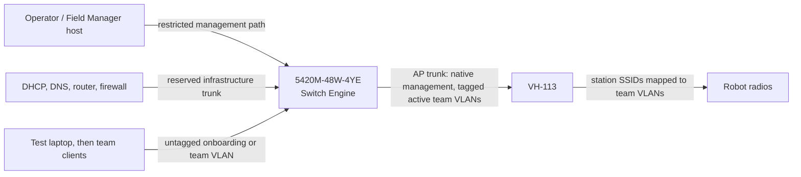

# Hardware setup guide

This guide commissions one Extreme Networks 5420M-48W-4YE managed switch and
one Vivid Hosting VH-113 field access point for FRC Practice Network. Complete
the work on an isolated bench before connecting team equipment.

> [!IMPORTANT]
> The real switch and AP adapters are implemented, but the server currently
> constructs `MockManagedSwitch`, `MockAccessPoint`, and
> `MockDhcpLeaseProvider` in `apps/server/src/context.ts`. Do not treat the
> current server startup as a production-hardware profile. Live use still
> requires explicit production context wiring, a real DHCP lease provider, and
> removal or disabling of `/api/dev` routes.

## 1. Equipment and prerequisites

Have these items ready:

- an Extreme 5420M-48W-4YE booted into **Switch Engine/ExtremeXOS**, not Fabric
  Engine/VOSS;
- a VH-113 running firmware that exposes `frc-radio-api`;
- a Field Manager host with trusted access to both management endpoints;
- DHCP, DNS, routing, and firewall infrastructure for the onboarding and team
  VLANs;
- a switch console cable and a local copy of the known-good switch
  configuration;
- an AP uplink cable and enough client/uplink cables for the planned topology;
- unique switch credentials and, if enabled on the AP, a bearer token;
- an approved channel, channel width, and regulatory configuration for the
  event location.

The application does not provide DHCP, DNS, routing, firewalling, ACLs, STP,
LACP, or PoE control. Those remain infrastructure responsibilities.

## 2. Freeze the field plan

Record the real values before entering any commands. The following is a
compatible example, not a universal default:

| Item                      | Example       | Notes                                            |
| ------------------------- | ------------- | ------------------------------------------------ |
| Management VLAN           | 100           | Native/untagged VLAN toward the VH-113           |
| Onboarding VLAN           | 999           | Initial untagged VLAN on client ports            |
| Active red bank           | 10, 20, 30    | Maps to red1, red2, red3                         |
| Active blue bank          | 40, 50, 60    | Maps to blue1, blue2, blue3                      |
| Spare bank                | 70, 80, 90    | May replace either alliance bank                 |
| Switch management address | Site-assigned | Dedicated Mgmt port or protected in-band address |
| AP management address     | Site-assigned | Reachable over the AP trunk's native VLAN        |
| Client ports              | Site-assigned | Only ports the application may reconfigure       |
| AP trunk port             | Site-assigned | Reserved; never a client port                    |
| Infrastructure uplink     | Site-assigned | Reserved and managed outside the application     |

The VH-113 does not accept an arbitrary VLAN for each slot. A slot's supported
VLANs are fixed by position:

| Slot  | Supported VLANs |
| ----- | --------------- |
| red1  | 10, 40, or 70   |
| red2  | 20, 50, or 80   |
| red3  | 30, 60, or 90   |
| blue1 | 10, 40, or 70   |
| blue2 | 20, 50, or 80   |
| blue3 | 30, 60, or 90   |

All three red slots use one bank, all three blue slots use one bank, and the
red and blue banks must be different. For six simultaneous networks, a simple
choice is red `10_20_30` and blue `40_50_60`. The allocator reads these
capabilities; it must not allocate VLAN 31 or another unsupported value to a
real VH-113 slot.

Use an SSID of 1-14 alphanumeric or hyphen characters and a WPA key of 8-16
alphanumeric characters. Field Manager's generated keys satisfy those limits.

## 3. Cable the bench topology

Keep management paths and team-facing ports distinct.



The switch's dedicated physical **Mgmt** port belongs to its special management
VLAN. That is separate from the configurable native VLAN carried to the AP.
It is valid to manage the switch out-of-band while managing the AP through
in-band VLAN 100. If the switch is managed in-band instead, reserve a protected
data port for that purpose and make sure the server cannot strand itself while
changing client ports.

Do not connect the client bank, production router, or VH-113 until switch
management works from the Field Manager host and a console recovery path is
available.

## 4. Commission the 5420M-48W-4YE

### 4.1 Establish console and management access

1. Connect locally to the serial console. The documented Switch Engine console
   settings are 115200 baud, 8 data bits, no parity, and 1 stop bit.
2. Log in, set unique administrator and failsafe credentials, and store them in
   the approved secret manager. A factory Switch Engine login may initially
   allow `admin` with a blank password; never leave it that way.
3. Run `show version` and confirm the model and **Switch Engine** software.
   Stop if the switch is running Fabric Engine/VOSS; this adapter cannot manage
   that operating system.
4. Assign the approved management address. For a named in-band VLAN, Switch
   Engine uses the following form:

   ```text
   configure vlan <management-vlan-name> ipaddress <address> <mask>
   ```

5. If the Field Manager host is outside that subnet, add only the reviewed
   management route/default gateway required by the site design.
6. Verify the new address from the Field Manager host before changing any data
   ports. Keep the console session open.

### 4.2 Enable the API transport

The adapter sends Basic-authenticated JSON-RPC `cli` requests to `/jsonrpc/`.
Enable HTTPS on Switch Engine:

```text
enable web https
```

Install a certificate whose chain and hostname/IP are trusted by the Field
Manager host. The adapter deliberately has no "ignore TLS errors" switch. An
isolated HTTP bench test can use an explicit `http://` base URL, but production
management should use HTTPS and a restricted management network. Do not use
`enable switch access` merely to enable the API: it enables several additional
management services.

Check reachability without placing a password in source control:

```sh
curl --fail --show-error --user "$FM_SWITCH_USER:$FM_SWITCH_PASSWORD" \
  --header 'Content-Type: application/json' \
  --data '{"jsonrpc":"2.0","method":"cli","params":["show version"],"id":1}' \
  https://switch-management.example/jsonrpc/
```

A JSON-RPC response is required. A login page, HTML error, certificate error,
or Fabric Engine response is not sufficient.

### 4.3 Build the VLAN baseline

Before making changes, capture `show configuration`, `show vlan`, `show ports`,
and the current management route. Use the site's approved backup/export
procedure. Do not remove the default VLAN or current management path until the
replacement path has been tested.

Pre-create and name the management, onboarding, and active team VLANs. The
adapter can create a missing VLAN as `FM-<VID>`, but pre-provisioning gives the
operator a reviewable baseline. Typical Switch Engine command forms are:

```text
create vlan FM-Mgmt tag 100
create vlan Onboarding tag 999
create vlan Team-10 tag 10
create vlan Team-20 tag 20
create vlan Team-30 tag 30
create vlan Team-40 tag 40
create vlan Team-50 tag 50
create vlan Team-60 tag 60
```

Adapt names and VLAN IDs to the frozen field plan. Never reuse VLAN 1 for
unassigned clients or management.

Configure only the reviewed ports:

- client ports: untagged onboarding VLAN 999 at rest;
- AP port: native/untagged management VLAN 100, with active team VLANs tagged;
- infrastructure uplink: VLAN 999 and every active team VLAN required by the
  DHCP/router design;
- Field Manager/management port: protected management access or the reviewed
  management trunk;
- unused ports: disabled or placed in an inert site-approved VLAN.

Do not copy a numeric port range from this guide. Confirm the standalone or
stacked port IDs on the installed switch. The adapter defaults to data ports
`1` through `52`; a stack may instead expose IDs such as `1:1`.

After every trunk change, use `show port <port> vid` and `show vlan` to confirm
untagged and tagged membership. Save the stable baseline only after console,
management, DHCP, and AP paths have all passed readback.

## 5. Commission the VH-113

1. Connect the VH-113 to the reserved AP trunk only after validating that
   trunk's native management VLAN.
2. Give the AP its approved management address and confirm it is reachable from
   the Field Manager host.
3. Confirm that the installed firmware exposes `frc-radio-api`, normally on
   port 8081. If bearer authentication is enabled, load the token into the
   Field Manager secret environment without committing it:

   ```sh
   read -r -s VH113_TOKEN
   export VH113_TOKEN
   curl --fail --show-error \
     --header "Authorization: Bearer $VH113_TOKEN" \
     http://ap-management.example:8081/health
   curl --fail --show-error \
     --header "Authorization: Bearer $VH113_TOKEN" \
     http://ap-management.example:8081/status
   ```

4. Record the firmware version, channel, channel width, red/blue banks, and all
   six current station configurations.
5. Verify that the chosen red and blue banks match the team VLANs tagged on the
   switch's AP port.
6. Configure one unused station first, associate a test radio, and verify that
   its MAC appears in the switch FDB on the correct VLAN.

The AP configuration endpoint replaces the complete six-slot document and its
status response does not reveal plaintext WPA keys. Consequently,
`VH113AccessPoint` refuses to change one slot if it cannot safely preserve the
plaintext desired state of the other configured slots. On process startup,
load every active slot into `initialConfigurations` from the credential store.
Do not reconstruct keys from the AP's returned hash and do not send a partial
manual configuration document.

## 6. Configure DHCP, DNS, and isolation

Provide a DHCP scope or relay path for:

- onboarding VLAN 999;
- each team VLAN that can be active (`10`, `20`, `30`, `40`, `50`, and `60` in
  the example); and
- the management VLAN only if the site design requires dynamic management
  addresses.

The production DHCP integration must support lease lookup by both IP and MAC.
The captive portal uses this chain:

```text
client IP -> DHCP lease -> client MAC -> switch FDB on onboarding VLAN -> port
```

Configure DNS/portal behavior on the onboarding VLAN. At the router or
firewall, default-deny traffic between team VLANs and deny client access to
switch, AP, server, and infrastructure management endpoints. Allow only the
explicit services the event design requires. Layer-2 VLAN separation alone does
not prevent inter-team traffic if a router permits it.

## 7. Wire the production adapters into the server

Use secrets supplied at runtime, explicit port roles, and addresses from the
field plan. The constructor shape is:

```ts
import { VH113AccessPoint } from "@repo/ap";
import { Extreme5420Switch } from "@repo/switch";

const managedSwitch = new Extreme5420Switch({
  info: {
    id: "switch-1",
    name: "Field Switch",
    managementAddress: process.env.FM_SWITCH_URL!,
  },
  baseUrl: process.env.FM_SWITCH_URL!,
  username: process.env.FM_SWITCH_USER!,
  password: process.env.FM_SWITCH_PASSWORD!,
  managementVlan: 100,
  onboardingVlan: 999,
  clientPorts: ["1", "2", "3", "4", "5", "6", "7", "8"],
  apTrunkPorts: ["52"],
  portRoles: {
    "49": "server",
    "50": "management",
    "51": "unused",
    "52": "ap-trunk",
  },
  saveConfiguration: false,
});

const accessPoint = new VH113AccessPoint({
  info: {
    id: "ap-1",
    name: "Practice Field VH-113",
    managementAddress: process.env.FM_AP_URL!,
  },
  baseUrl: process.env.FM_AP_URL!,
  token: process.env.FM_AP_TOKEN,
  initialConfigurations: loadActiveWirelessConfigurations(),
});

hardware.registerSwitch("switch-1", managedSwitch);
hardware.registerAccessPoint("ap-1", accessPoint);
```

The port list above is illustrative. `loadActiveWirelessConfigurations()` is a
placeholder for the production credential-backed loader; it is not currently
implemented. Replace the mocks in a distinct production context/profile rather
than conditionally repurposing the development context. The production context
must also provide a real `DhcpLeaseProvider`, exclude `SimulationService`, and
prevent `/api/dev` from being registered.

Leave `saveConfiguration` false for transient practice assignments unless the
site explicitly wants every successful write saved to switch flash. Persist the
reviewed switch baseline separately.

## 8. Commission one path end to end

Use a single expendable client port and a single unused AP slot first.

1. From the server host, call switch `getInfo()`, `getCapabilities()`,
   `getPort()`, and AP `getInfo()`/`getStations()` without making changes.
2. Confirm that model, OS, port IDs, VLANs, AP firmware, slots, and bank
   capabilities match the field plan.
3. Put the test client port on onboarding VLAN 999 and connect a laptop.
4. Confirm the laptop receives an onboarding lease and that its MAC is learned
   on the expected physical port and VLAN.
5. Create one team network using a VLAN supported by the selected VH-113 slot.
6. Verify switch write readback, port bounce, DHCP renewal, and the new team
   address.
7. Join the generated SSID with a test robot radio. Verify association and an
   FDB entry on the expected team VLAN.
8. Confirm the wired client and radio can communicate as intended, cannot reach
   another team VLAN, and cannot reach management endpoints.
9. Remove the test team. Confirm the client port returns to onboarding, the AP
   slot clears, and reconciliation reports no drift.
10. Restart each device during a maintenance window and verify the intended
    baseline/persistence behavior.

Expand to the remaining client ports and slots only after this path passes.

## 9. Go-live checklist

- [ ] Switch reports model 5420M-48W-4YE and Switch Engine/ExtremeXOS.
- [ ] Console recovery and a known-good configuration backup are available.
- [ ] Switch and AP credentials are unique and absent from source/logs.
- [ ] HTTPS certificate validation succeeds from the Field Manager host.
- [ ] Client, AP, infrastructure, server, and management ports are explicitly
      assigned and reserved as appropriate.
- [ ] AP native management and tagged team VLANs match switch readback.
- [ ] Red and blue use distinct VH-113 VLAN banks.
- [ ] DHCP lease lookup works by IP and MAC for real clients.
- [ ] Inter-team and client-to-management traffic is blocked upstream.
- [ ] All six possible active team VLANs have valid DHCP/route policy.
- [ ] One wired and one wireless assignment passed create, use, remove, and
      reconciliation tests.
- [ ] The production server context uses real adapters and does not expose
      `/api/dev`.
- [ ] Operators know how to disconnect automation and restore the saved
      baseline from the console.

## 10. Troubleshooting

| Symptom                              | Check                                                                                          |
| ------------------------------------ | ---------------------------------------------------------------------------------------------- |
| JSON-RPC returns HTML or 404         | Confirm Switch Engine, web API enablement, and `/jsonrpc/` URL                                 |
| TLS request fails                    | Install a trusted certificate with the correct hostname/IP; do not disable verification        |
| Adapter rejects the switch model     | Run `show version`; confirm 5420M-48W-4YE and Switch Engine                                    |
| Port write fails readback            | Inspect `show port <port> vid` and VLAN membership; look for reserved/stacked port IDs         |
| AP request is unauthorized           | Confirm bearer-token policy and secret injection                                               |
| AP refuses one-slot update           | Supply plaintext desired state for every other configured slot through `initialConfigurations` |
| AP rejects a VLAN                    | Select the correct VLAN for the slot position and alliance bank                                |
| AP loses management after trunking   | Recheck the AP port's native/untagged management VLAN                                          |
| Client never reaches the portal      | Check onboarding PVID, DHCP lease, DNS, and FDB MAC/port correlation                           |
| Client moves VLAN but has the old IP | Confirm the bounce completed and force DHCP renewal on the test client                         |
| Reconciliation reports drift         | Stop further writes, inspect device readback, then repair from known desired state             |

## References

- [Extreme 5420 Series: first Switch Engine login](https://documentation.extremenetworks.com/5420%20Series%20Installation%20Guide/Universal_Hardware/5420_Series_Installation_Guide/topics/log_in_for_the_first_time_on_switch_engine.shtml)
- [Extreme Switch Engine: enable web HTTPS](https://documentation.extremenetworks.com/switchengine_32.7.1/GUID-F755DBE4-B77C-46DF-8F1B-E5704DAA2C68.shtml)
- [Extreme JSON-RPC API](https://documentation.extremenetworks.com/exos/api/ClientApplications/JSONRPC/index.html)
- [FRC radio API](https://github.com/patfair/frc-radio-api)
- [VH-113 documentation](https://frc-radio.vivid-hosting.net/)
- [Local adapter behavior](hardware-adapters.md)
- [Logical field topology](network-design.md)
