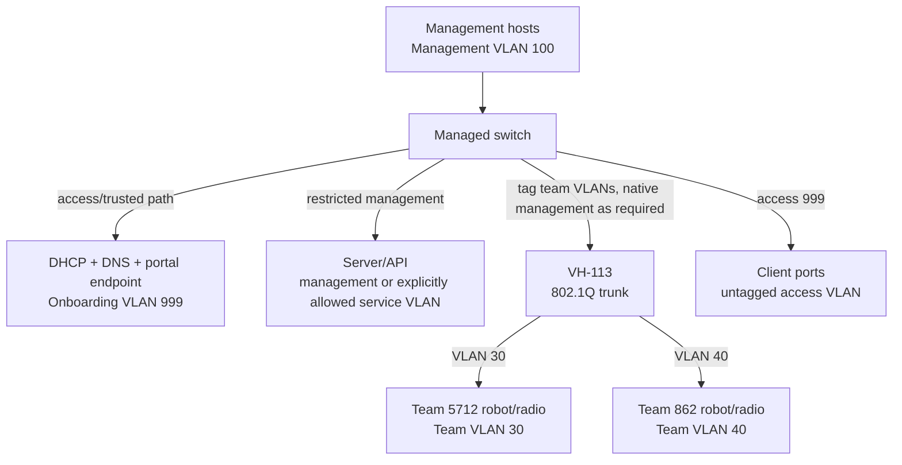

# Network design

This document describes the intended field topology. The application configures switch/AP desired state; it does not replace a DHCP server, DNS service, router, firewall, or a vendor's management plane.

## Logical topology



An example uses management VLAN 100, onboarding VLAN 999, and team VLANs allocated from 10–90. These are configuration values, not constants. Do not use VLAN 1 for unassigned clients or management. Every switch and AP trunk must be reviewed against the actual hardware's native/tagged VLAN behavior before deployment.

For a real VH-113, allocations are further constrained by station position and
the AP's three fixed VLAN banks. See the [hardware setup guide](hardware-setup.md)
for the supported mapping; the unrestricted 10-90 pool remains useful only for
adapters that report support for those VLANs.

## VLAN roles

| Role       | Purpose                                      | Typical switch behavior                                     |
| ---------- | -------------------------------------------- | ----------------------------------------------------------- |
| Management | Switch/AP/server administration              | Restricted access; never used for unassigned laptops        |
| Onboarding | DHCP, DNS, portal, and initial client access | Untagged access VLAN on unused/client ports                 |
| Team       | One isolated team's robot network            | Untagged access VLAN for wired clients; tagged on AP trunks |

The team VLAN allocator reserves management and onboarding VLANs and persists allocations. It must reject duplicate team-network allocations, return a VLAN only after the corresponding network is removed, and never infer a VLAN from the FRC team number.

## Expected switch configuration

Before the application is connected to a real switch, an administrator should establish:

- a management VLAN and management address reachable by the server;
- the onboarding VLAN with DHCP/DNS reachability;
- a team VLAN pool and any required upstream/trunk allowance;
- client ports initially in onboarding access mode;
- AP trunk ports tagged for the team pool and the AP's required management/native VLAN;
- server/management/AP ports marked as reserved application roles;
- default-deny or equivalent upstream policy between team VLANs where routing exists.

The adapter must expose only the operations the application needs: access VLAN, trunk VLAN set, link/enable state, bounce, MAC forwarding table, and readback. Vendor CLI/API commands belong in that adapter. The application should verify mode and VLAN after writes.

## DHCP and DNS placement

For production, DHCP should run on infrastructure reachable from the onboarding VLAN and each team VLAN. It may be a centralized DHCP server via relay, or separate scopes on a router/firewall. The server must record leases (or expose an API) so the application can answer `getLeaseByIp` and `getLeaseByMac`. Lease reservations are not required for the MVP.

DNS on the onboarding VLAN should resolve the portal hostname and commonly requested connectivity-check names to the portal or a controlled response, according to the operating systems being supported. Do not hijack DNS on team VLANs unless the event's network policy explicitly requires it. CAPPORT/DHCP option 114 can advertise a portal API/URI in a future integration; it is not required to complete the mock workflow.

```text
Client IP (onboarding)
  -> DHCP lease provider: IP 10.99.0.42 => MAC AA:BB:CC:DD:EE:FF
  -> switch MAC table: MAC + VLAN 999 => physical port 8
  -> application: port 8 access VLAN 30
  -> port bounce
  -> client renews DHCP on Team 5712 VLAN
```

## Isolation expectations

The switch provides Layer-2 separation by VLAN. A client port must carry one team access VLAN at a time, and a team AP SSID/slot must map to that team's VLAN. Multiple ports may share a VLAN. The application does not configure routing or ACLs, so any routed path between team VLANs is an infrastructure risk that must be addressed in the switch/router/firewall configuration.

## Link and health semantics

`linkUp` is physical/link-layer observation, not proof that a robot is reachable. Team status can be `waiting-for-robot` while VLAN configuration is correct but no AP/robot station is associated; `online` should require the adapter's connectivity signal. A link-down client port remains assigned but should be clearly shown as `link down` in the dashboard.
